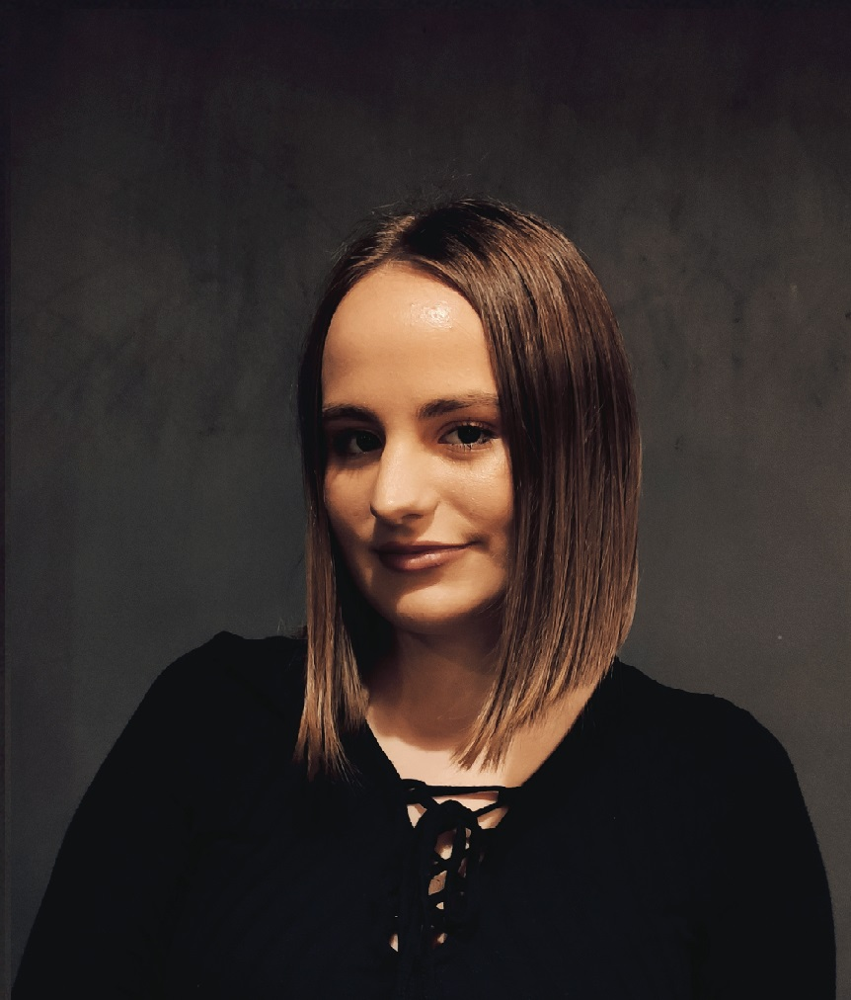

# Project-1

<!DOCTYPE html>

<html>
    <head>
        <!--
    Name: Farah Foco
    Course: Web application development CS412
    Assignment: Project 1
    Due date: 22 October 2021.
    Purpose: The purpose of this project is to apply HTML knowledge into making a functioning CV.

        -->
        <meta charset="UTF-8">
    <title>Project 1 - Farah Foco</title>
    </head>

    <body>
        <h1>Life of Farah Foco</h1>
        

        <li> <strong>Get to know me</strong></li>
        
 <b>Hello!</b>   
              
            My name is Farah Foco, born on 6thof April, 2001. I grew up in Old part of town in Sarajevo, near Bascarsija. Since, I can remember I was   
            interested about school and studying so I decided to start Primary school at age of 5. 
            Now I am 20 years old and 3rd/junior year at IUS.   While growing up I had many interests such as volleyball, dancing, balet and many more...
        

        

        <li> <strong>Timeline of my education:</strong></li>
        <ul type="circle">
            <li> Primary school - <em>"Safvet-beg Basagic"</em> (2006-2015)</li>
            <li> High school - <em>"First Bosniak Gymnasium - Cambridge International High School"</em> (2015-2019)</li>
            <li> Higher Education - <em>"International University of Sarajevo"</em> (2019-now)
                <em> <acronym title="Faculty of Engineering & Natural Sciences">FENS</acronym>, <acronym title="Computer Science & Engineering">CSE</acronym> </em></li>
        </ul>
        

        <li> <strong>Languages:</strong></li>
        <ol><li> Mother Tongue - Bosnian (speaking, writting: Full professional proficiency);</li>
            <li> Language  - English (speaking, writting: Full professional proficiency);</li>
            <li> Language - German (speaking, writting: Limited proficiency);</li>
            <li> Language - Turkish (speaking, writting:Limited proficiency).</li>
        </ol>
        

        <li> <strong>Hobbies:</strong></li>

        <table>
            <tr>
              
            
              <td colspan="2">Dance Types</td>
              
            </tr>
            <tr>
                <td>Street dance</td>
                <td>Hip-hop</td>
                
            </tr>
            <tr>
                <td>Elegant dance</td>
                <td>Waltz, Tango, Samba</td>
              </tr>
              <tr>
                <td>Latin dance</td>
                <td>Cha-Cha-Cha, Zumba</td>
              </tr>
              <tr>
                <td>French/Russian dance</td>
                <td>Ballet</td>
              </tr>
        </table>

        <ul type="disc">
            <li> Volleyball</li>
            <li> Photography</li>
            <li> Travelling</li>
        </ul>
        

        <li> <strong> Skill set:</strong></li>

        <ol>
            <li> Programming languages (C++, Java, MathLab, Quartus, R, HTML)</li>
            <li> Microsoft Excel</li>
            <li> AutoCAD</li>
            <li> Playing violin</li>
        </ol>

        <li> <strong> Reach me: </strong></li>
        

            Farah Foco, Hame Jabucice 27,71000 Sarajevo;  
            Call/Text: <a href="+38761007007">+38761007007;</a>  
            <a href="farahf@gmail.com">Send me an e-mail!</a>  
        

    </body>
    
</html>
